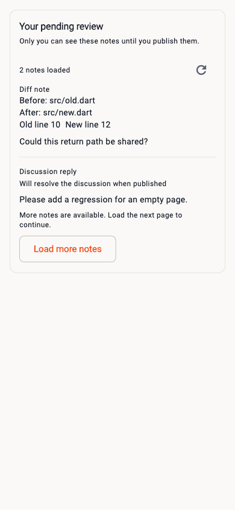
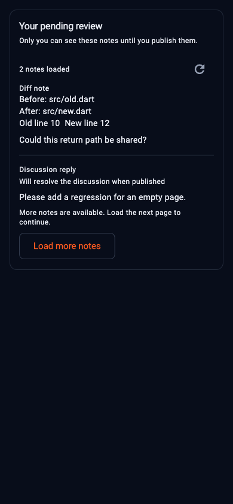
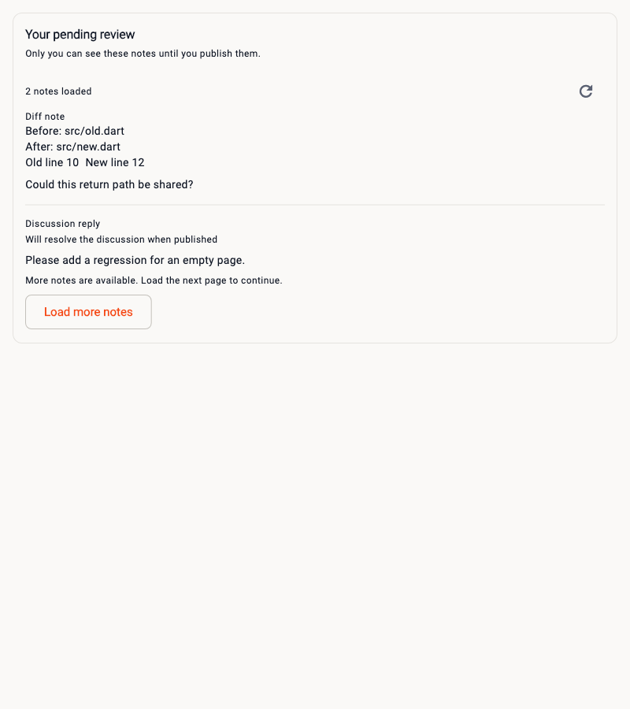
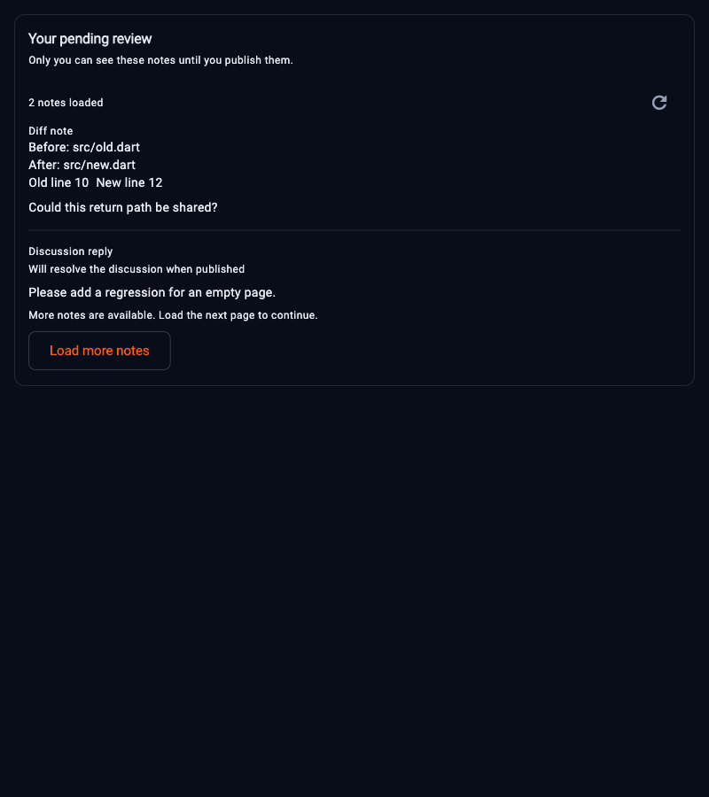
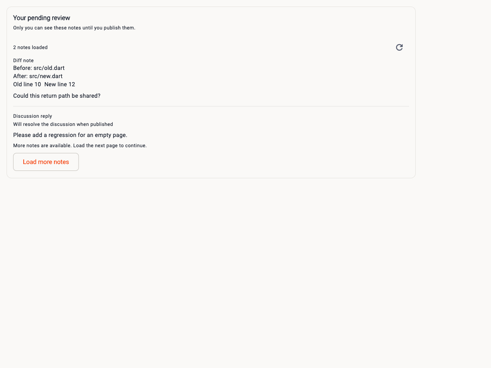
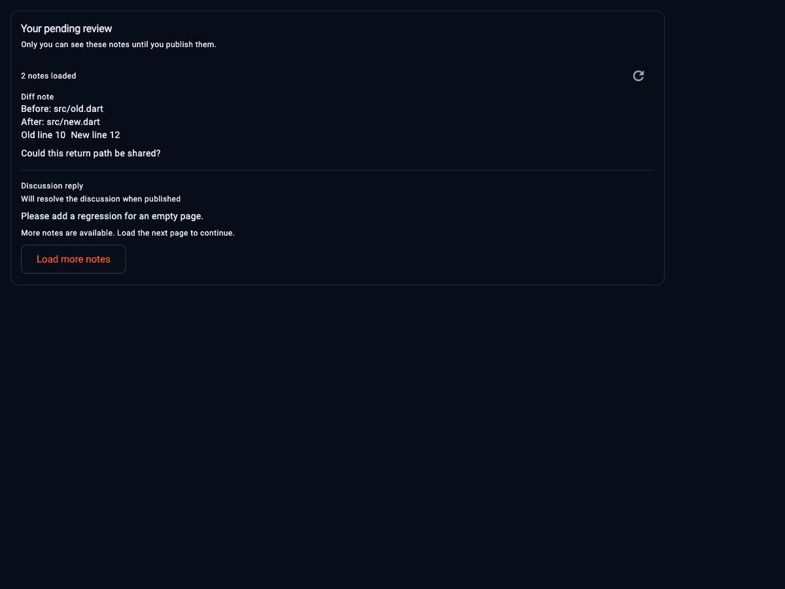

# Your private pending MR review

Issue [#604](https://github.com/Theorvane/labfox/issues/604) /
[PR #605](https://github.com/Theorvane/labfox/pull/605) connects the
[private pagination controller](mr-pending-review-reader.md) to MR detail.
**Your pending review** displays saved, unpublished server notes that belong to
the authenticated author. The saved-note reader remains read-only. The subsequent
[regular private composer](mr-pending-review-composer.md) adds an explicit
**Add review note** entry using [guarded save orchestration](mr-pending-review-save.md).
Positioned-save orchestration, editing/deletion and publication remain follow-ups.

## Reading and recovery

The panel uses the existing identifier-restorable MR detail route. It derives
its positive global MR identity from fresh authenticated detail and checks the
route IID and optional project identity, without substituting the global ID into
the route. Missing, invalid, loading or failed detail prevents draft dispatch.
The panel has distinct loading, empty, partial and error states.

Saved Markdown is displayed exactly as selectable text. It is not rendered into
remote images or clickable external links; opening the panel does not request
URLs embedded in a private note. Bounded scrollable bodies and a bounded lazy
note list keep long content usable on small windows. Known reply, commit,
resolution intent and original file metadata remain visible. Text single-line
coordinates are formatted through intl; multiline parent coordinates are not
presented as a complete range. Regular null text placeholders remain general
notes, while opaque line-code-only or future positions stay positioned notes.
No original anchor is inferred, re-anchored or navigated to a current diff.

**Load more notes** explicitly follows a cursor, including through empty pages.
Loaded counts describe only the displayed accumulated list, not a guessed server
total. Duplicate continuation controls are disabled while reading; rows remain
visible during same-session pagination. **Refresh pending review notes** clears
rows and returns to page one. A failed read hides all private rows and provides
**Retry**, which reads page one without replaying a mutation. Detail failures
retry authoritative detail before reading drafts. Errors use localized generic
messages, without displaying server payloads or previous-account toasts.

## Account and view changes

The UI watches the private presentation provider, never Riverpod's retained raw
controller values. Account, instance or client changes, sign-out, MR replacement,
detail refresh and failed reads remove old private rows. Layout resize or theme
changes keep current pages without another read. A signed-out panel is absent.

UI queries set `requireCurrentDetail: true` on `MrPendingReviewQuery`. The flag
participates in query equality and separates these consumers from standalone
reader queries. Guarded controller builds observe the current MR detail and its
repository, await fresh identity before dispatch, and recheck it before/after
pagination. This closes a reproduced race where an existing controller
subscription rebuilt for a new account before the UI frame removed its old query
and dispatched drafts ahead of new detail. A changed instance's global MR ID is
obtained from that instance's fresh detail; no old global identity is reused.

Already dispatched reads may finish on their original session. Obsolete
pagination data/errors are suppressed; superseded initial builds are discarded
by Riverpod. The reader introduces no disk cache, analytics event, write, publication or
approval; the separate regular composer sends an explicit guarded private save. The original API's normal read-only OAuth refresh is unchanged.
Offset pagination remains a best-effort read: cursor exhaustion is not an atomic
review snapshot or a publication authorization. The regular composer uses fresh inspection, current-view guards and shared
write reservations; these checks do not authorize publication.

## Verification and synthetic captures

The captures below show the original reader from PR #605. Current composer and
recovery captures are in [the composer documentation](mr-pending-review-composer.md).

The widget tests were written before the panel, integration and messages, and
failed for their missing implementation. Account/instance/client replacement
then reproduced the premature draft-dispatch race before the guarded-query fix.
A separate failing test covered a line-code-only position being mislabeled as a
general note. All added strings have English source and translations in Korean,
Japanese, Hindi and Chinese; delegates are generated with `flutter gen-l10n`.
The generator still reports the existing 109 untranslated messages per non-English
locale; none of the 23 new messages is missing.

Coverage checks exact selectable bodies with no image widgets, fresh and invalid
detail identity, actual detail-screen integration, loading/empty/partial states,
read-only retries, duplicate continuation, failed refresh, account/instance/client
and resource changes, same-account detail refresh, changed-instance global identity,
metadata kinds, five locales, three widths, both themes, long paths/bodies, doubled
text and resize/theme preservation. These are synthetic repository/widget tests,
not live GitLab, physical-device or store validation.

Regenerate captures with `LABFOX_PENDING_CAPTURE=<absolute-output-directory>` and
`FLUTTER_ROOT=<Flutter-SDK-directory>`, running `mr_pending_review_panel_test.dart`
with the filter `synthetic pending review capture`. The captures use existing SDK
Roboto and MaterialIcons fonts, including explicit button fonts in the test theme.
They show the isolated read-only panel with synthetic bodies and file paths.

| Viewport | Light | Dark |
|---|---|---|
| Mobile, 390 |  |  |
| Tablet, 800 |  |  |
| Desktop, 1200 |  |  |
